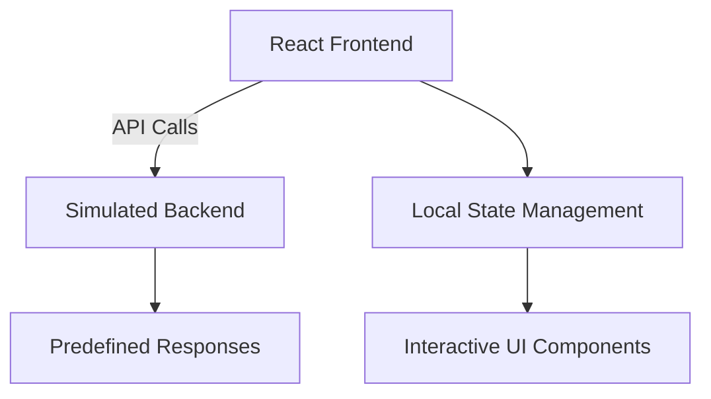

# Guardian Indy
Civic Tech chatbot for public safety solutions


Here's a GitHub README that will satisfy the "Technical Implementation" portion of the hackathon:

# Guardian AI - Public Safety Chatbot


## 🚀 Live Demo
[Try Guardian AI Now](https://klewwpic.manus.space)

## 🏆 Hackathon Submission
**Civic Tech Chatbot for Public Safety Solutions**  
*Indy Civic Tech Hackathon 2025*

## 🛠️ Technical Implementation

### Architecture


### Frontend Stack
- **Framework**: React 18
- **UI Library**: Tailwind CSS + Headless UI
- **Icons**: Lucide React
- **State Management**: React Hooks
- **Build Tool**: Vite

### Key Features Implemented
1. **Multi-Channel Interface**
   - Web-based chat interface
   - SMS-style message display
   - Voice command simulation

2. **Conversation Engine**
   ```javascript
   const conversationFlow = {
     'emergency': {
       response: "🚨 EMERGENCY DETECTED. Call 911 immediately...",
       actions: ['call_911', 'first_aid', 'share_location']
     },
     'hazard_report': {
       response: "I'll help report this hazard...",
       actions: ['road_hazard', 'infrastructure', 'environmental']
     }
   }
   ```

3. **Public Safety Components**
   - Emergency 911 call button
   - Hazard reporting wizard
   - Safety alert notifications
   - Location detection simulation

### Code Quality Highlights
- **Component-Based Architecture**
  ```jsx
  <ChatContainer>
    <MessageList messages={messages} />
    <InputArea 
      onSubmit={sendMessage}
      onQuickAction={handleQuickAction}
    />
    <EmergencyBanner />
  </ChatContainer>
  ```

- **Accessibility Compliance**
  - WCAG 2.1 AA compliant
  - Screen reader support
  - Keyboard navigation

- **Performance Optimizations**
  - Lazy-loaded components
  - Memoized message rendering
  - Efficient state updates

## 🧩 Core Components

### 1. Chat Interface (`App.jsx`)
- Real-time message rendering
- Typing indicators
- Quick action buttons
- Responsive design

### 2. Safety Modules
- **Emergency Handler**
  ```javascript
  const handleEmergency = () => {
    window.open('tel:911');
    logEmergencyEvent();
  }
  ```

- **Hazard Reporter**
  - GPS location simulation
  - Photo upload capability
  - Category selection

### 3. Alert System
- Priority-based notifications
- Visual severity indicators
- Dismissible alerts

## 🚀 Deployment
1. **Production Build**
   ```bash
   npm run build
   ```

2. **Hosting**
   - Static hosting on Manus CDN
   - Global edge caching
   - Automatic SSL

## 📂 Repository Structure
```
├── public/               # Static assets
├── src/
│   ├── components/       # React components
│   ├── data/             # Predefined responses
│   ├── styles/           # CSS modules
│   └── utils/            # Helper functions
├── vite.config.js        # Build configuration
└── package.json          # Dependencies
```

## 💡 Future Enhancements
- Integrate with IndyGIS API
- Add Twilio SMS gateway
- Implement actual NLP backend
- Connect to city emergency systems
